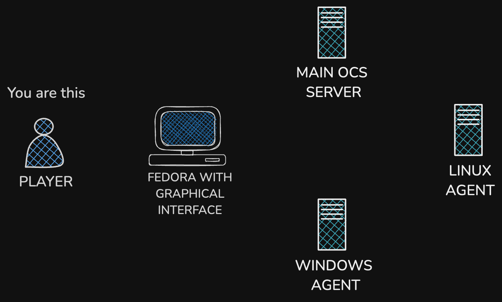

# TALLER DE OCS INVENTORY NG, By. Jose Bautsita

----

## INTRODUCCION 

## LABORATORIOS (playground)

### Laboratorio participante 01 (Javier) 
| HOSTNAME   | USER    | PASSWORD | ADDRESS  |
|------------|---------|----------|----------|
| Fedora     | player01| prayer01 | 10.0.0.2 |
| Ubuntu     | player01| prayer01 | 10.0.0.3 |
| Debian     | player01| prayer01 | 10.0.0.4 |
| CentOS     | player01| prayer01 | 10.0.0.5 |

## RECURSOS

## DEPENDENCIAS
Íß
## INSTALACION

## CONFIGURACION

## CONCLUSION