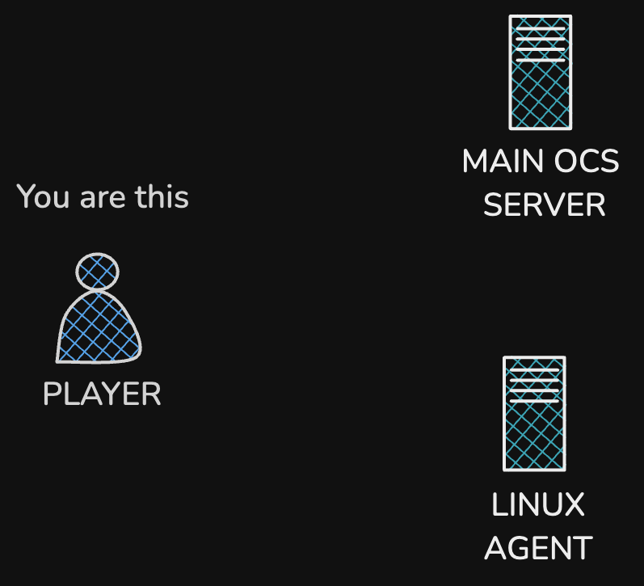
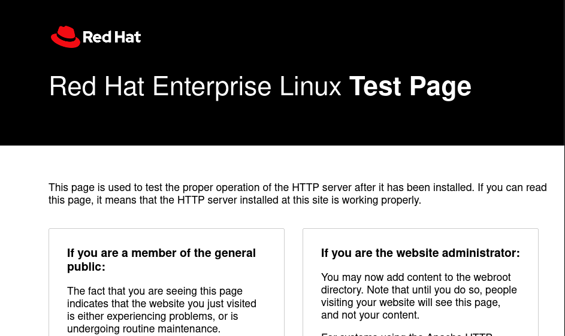

# TALLER DE OCS INVENTORY NG, By. Jose Bautsita

----


## LABORATORIOS (playground)



<details>
 <summary> Lab </summary>

#### Requisitos de Hardware 

| host               | cpu's     | ram    | memory |
|--------------------|---------|--------|----------|
| MAIN OCS SERVER    |  4      | 4 GB   | 30 GB    | 
| OCS AGENT          |  2      | 2GB    | 20GB     |

### Laboratorio participante 01 (Mike)

| HOSTNAME           | USER    | PASSWORD   | ADDRESS   | ROOT PASSWORD |
|--------------------|---------|------------|-----------|---------------|
| MAIN OCS SERVER    |  mike   | mike2025   | 10.0.0.190  | taller2025    |
| OCS AGENT          |  mike   | mike2025   | 10.0.0.191  | taller2025    |

### Laboratorio participante 02 (Javier)

| HOSTNAME           | USER    | PASSWORD   | ADDRESS   | ROOT PASSWORD |
|--------------------|---------|------------|-----------|---------------|
| MAIN OCS SERVER    | javi    | javi2025   | 10.0.0.192  | taller2025    |
| OCS AGENT          | javi    | javi2025   | 10.0.0.193  | taller2025    |

### Laboratorio participante 03 (Oliver)

| HOSTNAME           | USER    | PASSWORD   | ADDRESS   | ROOT PASSWORD |
|--------------------|---------|------------|-----------|---------------|
| MAIN OCS SERVER    | oliver  | oliver2025 | 10.0.0.195  | taller2025    |
| OCS AGENT          | oliver  | oliver2025 | 10.0.0.194 | taller2025    |

### Laboratorio participante 04 (Miguel Martinez)

| HOSTNAME           | USER    | PASSWORD   | ADDRESS   | ROOT PASSWORD |
|--------------------|---------|------------|-----------|---------------|
| MAIN OCS SERVER    | antonio  | antonio2025 | 10.0.0.197  | taller2025    |
| OCS AGENT          | antonio  | antonio2025 | 10.0.0.196  | taller2025    |

### Laboratorio participante 05 (Angel)

| HOSTNAME           | USER    | PASSWORD   | ADDRESS   | ROOT PASSWORD |
|--------------------|---------|------------|-----------|---------------|
| MAIN OCS SERVER    | angel   | angel2025  | 10.0.0.200  | taller2025    |
| OCS AGENT          | angel   | angel2025  | 10.0.0.199  | taller2025    |

### Laboratorio participante 06 (Brandon)

| HOSTNAME           | USER    | PASSWORD   | ADDRESS   | ROOT PASSWORD |
|--------------------|---------|------------|-----------|---------------|
| MAIN OCS SERVER    | brandom  | brandom2025 | 10.0.0.181 | taller2025   |
| OCS AGENT          | brandom  | brandom2025 | 10.0.0.180 | taller2025   |

### Laboratorio participante 07 (Alondra)

| HOSTNAME           | USER    | PASSWORD   | ADDRESS   | ROOT PASSWORD |
|--------------------|---------|------------|-----------|---------------|
| MAIN OCS SERVER    | alondra | alondra2025 | 10.0.0.183  | taller2025 |
| OCS AGENT          | alondra | alondra2025 | 10.0.0.182  | taller2024 |

### Laboratorio participante 08 (Omar)

| HOSTNAME           | USER    | PASSWORD   | ADDRESS   | ROOT PASSWORD |
|--------------------|---------|------------|-----------|---------------|
| MAIN OCS SERVER    | omar    | omar2025   | 10.0.0.185  | taller2025  |
| OCS AGENT          | omar    | omar2025   | 10.0.0.184  | taller2025  |


### Laboratorio participante 09 (Jatzy)

| HOSTNAME           | USER    | PASSWORD   | ADDRESS   | ROOT PASSWORD |
|--------------------|---------|------------|-----------|---------------|
| MAIN OCS SERVER    |  jatzy  | jatzy2025 | 10.0.0.187   | taller2025    |
| OCS AGENT          |  jatzy  | jatzy2025 | 10.0.0.186   | taller2025    |


### Laboratorio participante 10 (Sergio)

| HOSTNAME           | USER    | PASSWORD   | ADDRESS   | ROOT PASSWORD |
|--------------------|---------|------------|-----------|---------------|
| MAIN OCS SERVER    |  sergio | sergio2025 | 10.0.0.188   | taller2025   |
| OCS AGENT          |  sergio | sergio2025 | 10.0.0.189   | taller2025   |

### Laboratorio participante 11 (Hector)

| HOSTNAME           | USER    | PASSWORD   | ADDRESS   | ROOT PASSWORD |
|--------------------|---------|------------|-----------|---------------|
| MAIN OCS SERVER    |  hector | hector2025 | 10.0.0.221  | taller2025   |
| OCS AGENT          |  hector | hector2025 | 10.0.0.220  | taller2025   |

### Laboratorio participante 12 (Miguel Perez)

| HOSTNAME           | USER    | PASSWORD   | ADDRESS   | ROOT PASSWORD |
|--------------------|---------|------------|-----------|---------------|
| MAIN OCS SERVER    | miguel  | miguel2025 | 10.0.0.224  | taller2025    |
| OCS AGENT          | miguel  | miguel2025 | 10.0.0.222  | taller2025    |

 </details>

## RECURSOS

- OCS INVENTORY NG SERVER

```bash
wget
```

- OCS INVENTORY UNIX/AGENTE

```bash
wget
```


## DEPENDENCIAS


## INSTALACION

### Paso 1: Instalacion y Configuracion de MariaDB.

#### 1.1 instalacion.

```bash
sudo dnf install -y mariadb-server mariadb
```

#### 1.2: Iniciar y habilitar el servicio de MariaDB

```bash
# Iniciar el servicio
sudo systemctl start mariadb

# Habilitar para que arranque en el inicio del sistema
sudo systemctl enable mariadb
```
#### 1.3: Verificar el estado del servicio.

```bash
sudo systemctl status mariadb.service
```
- Si todo está bien, debería mostrar algo como:
```bash
Active: active (running)
```
### 1.4: Configurar MariaDB con mysql_secure_installation.

 ```bash
sudo mysql_secure_installation
```
- Durante la configuración:
```
Enter current password for root: Presiona Enter si no hay contraseña.

Set root password? [Y/n]: Y para establecer una contraseña para root (dbaccespass).

Remove anonymous users? [Y/n]: Y

Disallow root login remotely? [Y/n]: Y

Remove test database and access to it? [Y/n]: Y

Reload privilege tables now? [Y/n]: Y
```


#### 1.5: Creacion de las base de datos y el suario para ocs inventory.
 
- Base de Datos (ocsdb)

```sql

CREATE DATABASE ocsweb CHARACTER SET utf8mb4 COLLATE utf8mb4_unicode_ci;

```
- Db User (ocs_user)
```sql
CREATE USER 'ocs_user'@'localhost' IDENTIFIED BY 'pass';
```
> [!CAUTION]
> Cambia **pass** por una contraseña segura.

- Otorgar permisos al usuario sobre la base de datos

```sql
GRANT ALL PRIVILEGES ON ocsweb.* TO 'ocs_user'@'localhost';
```
>[!NOTE]
>Esto permite que **ocs_user** tenga control total sobre la base de datos **ocs_db**.

- Aplicar los cambios y salimos.
```sql
FLUSH PRIVILEGES;

EXIT;
```
---


### Paso 2: Instalacion del servidor APACHE (HTTPD)

#### 2.1: Instalar Apache

```bash
sudo dnf install -y httpd
```
#### 2.2: Iniciar y habilitar Apache

```bash
# Iniciar el servicio de Apache
sudo systemctl start httpd

# Habilitar Apache para que arranque en el inicio del sistema
sudo systemctl enable httpd

```

#### 2.3: Verificar el estado del servicio

```bash
sudo systemctl status httpd

```
- Si todo está bien, debería mostrar algo como:
```bash
Active: active (running)
```

#### 2.4: Configurar el firewall para permitir tráfico HTTP/HTTPS

```bash
# Permitir tráfico HTTP
sudo firewall-cmd --permanent --add-service=http

# Permitir tráfico HTTPS
sudo firewall-cmd --permanent --add-service=https

# Recargar la configuración del firewall
sudo firewall-cmd --reload
```
- Verificar que Apache sirva contenido:
```
http://<tu-ip>/
```


---


### Paso 3: otras dependecias


#### 3.1: Instalar PHP y módulos necesarios
```bash

sudo dnf install -y php php-mysqlnd
```
#### 3.2: Verificar la instalación de PHP

```bash
php -v
```
- Si todo está bien, debería mostrar algo como:
```bash
Active: active (running)
```

#### 3.4: Reiniciar Apache para aplicar cambios

```bash
sudo systemctl restart httpd
```

## Instalacion de ocs inventory


## CONFIGURACION


## CONCLUSION